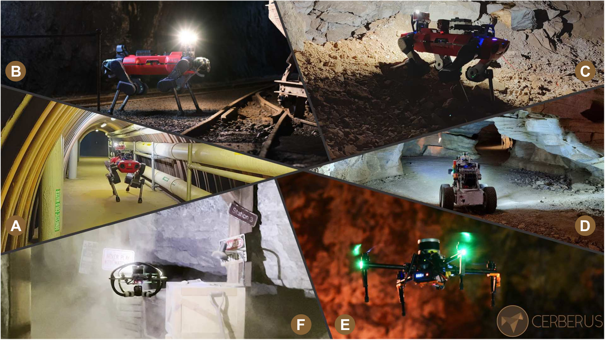
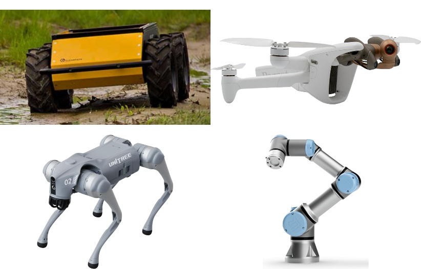

<!-- _class: lead -->
<!-- _header: "" -->
<!-- _footer: "" -->

# Introduction to ROS 2

## Overview & Fundamental Concepts

Jazzy Jalisco · Simulated robots

Venture into WVU — Space Robotics

---

## Today

- **Morning (this session, ~2h):** lecture — what ROS 2 is, and the concepts every ROS 2 system is built from.
- **Afternoon (~2h):** hands-on — explore these concepts yourself, individually, in simulation.
- **Later this program:** write your own nodes, then deploy Nav2 to a real robot.

Everything today runs in simulation, inside a WSL2 Ubuntu 24.04 environment or Docker.

---

## Agenda

1. What is ROS 2?
2. Nodes
3. Messages / Interfaces
4. Topics
5. Services
6. Actions
7. Parameters
8. TF2 (coordinate frames)
9. Launch
10. Packages, Workspaces, Distributions

---

## Before we start: validate setup

Open a terminal in your WSL2 Ubuntu 24.04 or Docker and run:

```bash
printenv ROS_DISTRO        # should print: jazzy
ros2 doctor                # checks your install for common problems
```

> **Try it:** if `ROS_DISTRO` is empty, you likely forgot to source ROS 2 —
> see step 6 of the install guide: `source /opt/ros/jazzy/setup.bash`.

We'll use **turtlesim**, a tiny 2D simulator that ships with `ros-jazzy-desktop`,
for almost every live demo today.

---

## ROS: Robot Operating System


> The Robot Operating System (ROS) is a set of software libraries and tools that help you build robot applications. 

ROS is not a literal operating system, but an **open-source ecosystem** for robot software, with three pieces:

| Piece | What it gives you |
|---|---|
| **Framework** | messaging, interfaces, and multi-language client libraries for talking between processes |
| **Tools** | build, test, visualize, record/replay (`colcon`, `rviz2`, `ros2 bag`, ...) |
| **Capabilities** | robot drivers, algorithms and packages for navigation, manipulation, perception, ... |

[`docs.ros.org/en/jazzy/About-ROS.html`](https://docs.ros.org/en/jazzy/About-ROS.html)

ROS fosters reuse, standardization, and reduces the need to reinvent the wheel.

---

## Case study: the DARPA Subterranean Challenge

A multi-year competition (2018-2021) sending teams of robots (legged,
wheeled, and flying) to **autonomously** map, navigate, and search
unmapped underground environments (tunnels, urban infrastructure, caves)
with no GPS and unreliable comms.

> "We suspect that most if not all the teams used ROS in some capacity."
> [openrobotics.org/blog/2021/9/27/darpa-subt-final-competition](https://www.openrobotics.org/blog/2021/9/27/darpa-subt-final-competition)




---

## Robots that ship with ROS drivers
<center>



</center>

---

## Nodes

> A node is **"a participant in the ROS 2 graph, which uses a client library
> to communicate with other nodes."**

- Each node should have **one modular purpose** (e.g. drive a sensor, run a filter, plan a path).
- Nodes can live in the same process, separate processes, or separate machines.
- A single node can simultaneously be a publisher, subscriber, service server/client,
  and action server/client.
- Nodes find each other via automatic **discovery** — no central registry.

`docs.ros.org/en/jazzy/Concepts/Basic/About-Nodes.html`

---

## Demo: run example nodes

**Terminal 1:**

```bash
ros2 run turtlesim turtlesim_node
```

**Terminal 2:**

```bash
ros2 run turtlesim turtle_teleop_key
```

> **Try it:** click into terminal 2 and use the arrow keys — the turtle
> moves in terminal 1's window. Two separate processes, talking over ROS 2.
> **Leave both running**  we'll reuse this turtle all lecture.

---


## Demo: inspecting nodes

With `turtlesim_node` and `turtle_teleop_key` still running:

```bash
ros2 node list
ros2 node info /turtlesim
```

`ros2 node info` shows everything a node publishes, subscribes to, serves,
and calls — a quick way to understand any unfamiliar node.

> **Try it:** launch a *second* turtlesim node under a different name:
> ```bash
> ros2 run turtlesim turtlesim_node --ros-args --remap __node:=my_turtle
> ros2 node info /my_turtle
> ```
> (close it with Ctrl+C when done — we only need one turtlesim for now)

---


## Messages / Interfaces

ROS 2 nodes communicate through three interface types, each described in a
small **Interface Definition Language (IDL)** file:

| File | Describes |
|---|---|
| `.msg` | one-way data — a **topic** message |
| `.srv` | a request **and** a response, separated by `---` |
| `.action` | goal / result / feedback, separated by two `---` lines |

Every field is **strongly typed**: `bool`, `int32`, `float64`, `string`,
arrays (`int32[]`, `int32[5]`), nested message types, and `UPPERCASE` constants.

[`docs.ros.org/en/jazzy/Concepts/Basic/About-Interfaces.html`](https://docs.ros.org/en/jazzy/Concepts/Basic/About-Interfaces.html)

---

## Demo: reading interface definitions

```bash
ros2 interface show geometry_msgs/msg/Twist
ros2 interface show turtlesim/srv/Spawn
ros2 interface show turtlesim/action/RotateAbsolute
```

> **Try it:** `Twist` is the message that drives the turtle. Find every
> other message type turtlesim uses:
> ```bash
> ros2 interface list | grep -i turtle
> ```

We'll see exactly how `.msg`, `.srv`, and `.action` map to topics, services,
and actions in the next three sections.

---

## Topics

Topics implement **publish/subscribe**: publishers and subscribers with the
same topic name exchange messages **directly**, **many-to-many**, without
knowing about each other ("anonymous").

- Best for **continuous data streams**: sensor readings, robot state, control commands.
- **Strongly typed** — both at the field level and semantically (e.g. an IMU's
  angular velocity is defined to be radians/second).
- A topic can have **zero, one, or many** publishers and subscribers.

`docs.ros.org/en/jazzy/Concepts/Basic/About-Topics.html`

---

## Demo: listening to a topic

```bash
ros2 topic list
ros2 topic list -t                    # with message types
ros2 topic info /turtle1/cmd_vel --verbose
ros2 topic echo /turtle1/pose
```

> **Try it:** with `topic echo` running, switch to `turtle_teleop_key` and
> drive the turtle. Watch `/turtle1/pose` update live.

```bash
ros2 topic hz /turtle1/pose            # publish rate
```

---

## Demo: publishing to a topic

You don't need `turtle_teleop_key` to drive the turtle — anything that
publishes the right message on the right topic will do:

```bash
ros2 topic pub -r 1 /turtle1/cmd_vel geometry_msgs/msg/Twist \
  "{linear: {x: 2.0}, angular: {z: 1.8}}"
```

> **Try it:** run that, then in another terminal:
> ```bash
> ros2 topic pub --once /turtle1/cmd_vel geometry_msgs/msg/Twist \
>   "{linear: {x: 0.0}, angular: {z: 0.0}}"
> ```
> to stop it. `-r 1` repeats at 1 Hz; `--once` sends a single message.

This is exactly what a real controller node does — `ros2 topic pub` just lets
*you* be the publisher, from the command line.

---

## Services

A service is a **remote procedure call**: a client sends a **request** and
waits while the server computes and returns a **response**.

- Exactly **one server** per service name; any number of clients.
- Services are **synchronous / short-lived** — never use one for long-running
  work (that's what actions are for).
- Good for: "do this one thing now and tell me the result" (clear the screen,
  spawn an object, toggle a mode).

[`docs.ros.org/en/jazzy/Concepts/Basic/About-Services.html`](https://docs.ros.org/en/jazzy/Concepts/Basic/About-Services.html)

---

## Demo: calling a service

```bash
ros2 service list -t
ros2 service type /clear
ros2 service call /clear std_srvs/srv/Empty
```

`std_srvs/srv/Empty` takes no request fields and returns nothing — the
simplest possible service.

> **Try it:** spawn a second turtle by calling `/spawn` with a filled-in request:
> ```bash
> ros2 service call /spawn turtlesim/srv/Spawn \
>   "{x: 2, y: 2, theta: 0.2, name: 'turtle2'}"
> ros2 node list
> ```
> Notice a **new node**, `/turtle2`... wait — actually a new *topic namespace*
> appears (`/turtle2/...`) served by the same `/turtlesim` node.


---

## Actions

An action is **"a long-running remote procedure call with feedback and the
ability to cancel or preempt the goal."** Three parts:

- **Goal** — what you're asking for (like a service request)
- **Feedback** — progress updates streamed back during execution
- **Result** — the final outcome (like a service response)

Example from the docs: sending a navigation waypoint, watching progress, and
being able to cancel — this is exactly how **Nav2** goals work.

Exactly **one server** per action name; any number of clients.

`docs.ros.org/en/jazzy/Concepts/Basic/About-Actions.html`

---

## Demo: sending an action goal

```bash
ros2 action list -t
ros2 action info /turtle1/rotate_absolute
```

```bash
ros2 action send_goal /turtle1/rotate_absolute \
  turtlesim/action/RotateAbsolute "{theta: 1.57}" --feedback
```

> **Try it:** watch the turtle rotate to face `theta = 1.57` radians (90°),
> with feedback messages streaming into your terminal as it turns. Try
> `theta: -1.57` next, and try **Ctrl+C during the rotation** to see what a
> cancelled goal looks like.

---

## Parameters

A parameter is a **per-node, typed configuration value** — a way to configure
a node's behavior without changing its code.

- Types: `bool`, `int64`, `float64`, `string`, `byte[]`, and array variants.
- Nodes normally **declare** their parameters up front, for type safety.
- Set at **startup** (via a YAML params file) or at **runtime** (via a service call).
- `ros2 param set` changes are **not persistent** across restarts unless saved.

`docs.ros.org/en/jazzy/Concepts/Basic/About-Parameters.html`

---

## Demo: reading and changing parameters

```bash
ros2 param list
ros2 param get /turtlesim background_g
ros2 param set /turtlesim background_r 150
```

> **Try it:** the turtlesim background color changes live. Set
> `background_g` and `background_b` too — no restart needed.

```bash
ros2 param dump /turtlesim          # save current parameters to YAML
```

---

## TF2 (transforms)

tf2 is ROS 2's library for tracking the relationship between many **3D
coordinate frames** (world, base, gripper, sensor, ...) **over time**, as a
tree, so any node can ask:

> "Where was the *gripper* frame relative to the *world* frame 5 seconds ago?"

- Works in a **distributed** system — nodes broadcast and listen to transforms independently.
- Built on ordinary topics under the hood, but with its own tooling because
  frames form a **tree**, buffered in time.
- Essential for anything that fuses sensors, or reasons about robot pose —
  this is core machinery for **Nav2**.

`docs.ros.org/en/jazzy/Concepts/Intermediate/About-Tf2.html`

---

## Demo: exploring a transform tree

This uses a dedicated demo package (separate from your running turtlesim):

```bash
sudo apt install ros-jazzy-turtle-tf2-py ros-jazzy-tf2-tools
ros2 launch turtle_tf2_py turtle_tf2_demo.launch.py
```

**New terminal:**

```bash
ros2 run turtlesim turtle_teleop_key
ros2 run tf2_ros tf2_echo turtle2 turtle1
```

> **Try it:** drive `turtle1` around — a second turtle (`turtle2`) mimics
> it, and `tf2_echo` prints the live transform between the two frames.
> Then try: `ros2 run tf2_tools view_frames` — it saves a PDF of the frame tree.

---

## Launch

Real ROS 2 systems have **many nodes** across many processes. A **launch
file** (Python, XML, or YAML) starts them all with one command — with
arguments, namespaces, and remappings — and is run with `ros2 launch`.

You've already used it: `turtle_tf2_demo.launch.py` a moment ago started
*three* nodes for you at once.

`docs.ros.org/en/jazzy/Concepts/Basic/About-Launch.html`

---

## A minimal launch file

```python
from launch import LaunchDescription
from launch_ros.actions import Node

def generate_launch_description():
    return LaunchDescription([
        Node(package='turtlesim', executable='turtlesim_node',
             namespace='turtlesim1'),
        Node(package='turtlesim', executable='turtlesim_node',
             namespace='turtlesim2'),
        Node(package='turtlesim', executable='mimic',
             remappings=[
                 ('/input/pose', '/turtlesim1/turtle1/pose'),
                 ('/output/cmd_vel', '/turtlesim2/turtle1/cmd_vel'),
             ]),
    ])
```

**Demo:** save this as `mimic_launch.py`, then:

```bash
ros2 launch mimic_launch.py
```

> Two turtles appear; driving `turtlesim1`'s turtle drives `turtlesim2`'s too.

---

## Packages

> "A package is an organizational unit for your ROS 2 code" — the basic unit
> you build and share.

- **`ament_python`** packages: `package.xml`, `setup.py`, `setup.cfg`, a
  `<package_name>/` module directory. (This is what you'll use this week.)
- **`ament_cmake`** packages: `package.xml`, `CMakeLists.txt`, `src/`, `include/`.
- Every package you've used today — `turtlesim`, `turtle_tf2_py`,
  `geometry_msgs` — is just a package like the ones you'll build tomorrow.

`docs.ros.org/en/jazzy/Tutorials/Beginner-Client-Libraries/Creating-Your-First-ROS2-Package.html`

---

## Demo: inspecting packages

```bash
ros2 pkg list | grep turtle
ros2 pkg prefix turtlesim
ros2 pkg executables turtlesim
ros2 pkg xml turtlesim
```

> **Try it:** `ros2 pkg prefix` shows *where* a package is installed —
> under `/opt/ros/jazzy` for anything from `apt`. This afternoon, when you
> build your own package, it will show up under your workspace instead.

*(We'll create our own package with `ros2 pkg create` in the programming session.)*

---

## Workspaces

> "A workspace is a directory containing ROS 2 packages."

- **Underlay**: the base ROS 2 install you `source` first — `/opt/ros/jazzy/setup.bash`.
- **Overlay**: your own workspace, built with `colcon` and sourced *on top of*
  the underlay. Overlay packages take priority over same-named underlay ones.
- Sourcing order matters: underlay first, overlay second, every new shell.

`docs.ros.org/en/jazzy/Tutorials/Beginner-Client-Libraries/Colcon-Tutorial.html`

---

## Demo: seeing the underlay

```bash
echo $AMENT_PREFIX_PATH | tr ':' '\n'
ros2 pkg prefix turtlesim
```

> **Try it:** right now, everything on `AMENT_PREFIX_PATH` is your
> **underlay** (`/opt/ros/jazzy`) — there's no overlay yet. This afternoon,
> after `colcon build && source install/setup.bash`, you'll see your own
> workspace prepended to this list.

---

## Distributions

> "A ROS distribution is a versioned set of ROS packages" — like a Linux
> distro. Once released, core packages get bug fixes only, no breaking changes.
> A new distribution ships roughly once a year.

| Codename | Released | Ubuntu target | Support until |
|---|---|---|---|
| Humble Hawksbill | May 2022 | 22.04 Jammy | ~2027 |
| Iron Irwini | May 2023 | 22.04 Jammy | EOL (Nov 2024) |
| **Jazzy Jalisco (10th release)** | **May 2024** | **24.04 Noble** | **~2029** |
| Kilted Kaiju | 2025 | 24.04 Noble | — |

We use **Jazzy** because it's the latest release supported by **Crazyswarm2**,
and it's a 5-year LTS release tied to Ubuntu 24.04.

---

## Demo: checking your distribution

```bash
printenv ROS_DISTRO
ros2 doctor --report | less
```

`ros2 doctor` checks your platform, network config, and installed packages
for common setup problems — good first move whenever something seems broken.

---
<!-- _class: lead -->
# Recap
---

## The ROS graph


- **Nodes** are the actors. **Messages** define the data shape.
- **Topics / services / actions** are the three ways nodes talk.
- **Parameters** configure a node; **TF2** tracks where things are.
- **Packages** hold code; **workspaces** hold packages; **launch** starts it
  all; **distributions** version the whole ecosystem.

---

## Cheat sheet

| Concept | Inspect | Info | Do something |
|---|---|---|---|
| Node | `ros2 node list` | `ros2 node info <n>` | — |
| Topic | `ros2 topic list` | `ros2 topic info <t>` | `pub` / `echo` / `hz` |
| Service | `ros2 service list` | `ros2 service type <s>` | `call` |
| Action | `ros2 action list` | `ros2 action info <a>` | `send_goal` |
| Parameter | `ros2 param list` | `ros2 param get` | `set` / `dump` / `load` |
| Interface | `ros2 interface list` | `ros2 interface show <i>` | — |
| Package | `ros2 pkg list` | `ros2 pkg prefix <p>` | `create` |
| Launch | — | — | `ros2 launch <file>` |

---

## This afternoon

You'll code your own nodes and packages in python, individually, at your own pace.
We'll use more realistic robot simulators with tools deployed in practice:

- RViz2 to visualize and control the robots.
- Nav2 for path planning and execution.
- SLAM toolbox for mapping and localization.

---

## Resources

- Official docs: `docs.ros.org/en/jazzy/`
- Tutorials index: `docs.ros.org/en/jazzy/Tutorials.html`
- CLI tools tutorials: `docs.ros.org/en/jazzy/Tutorials/Beginner-CLI-Tools/`

---
